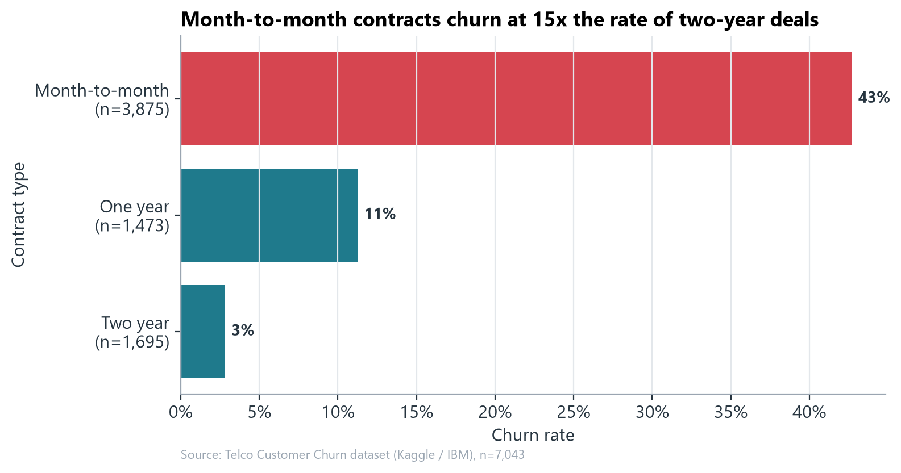
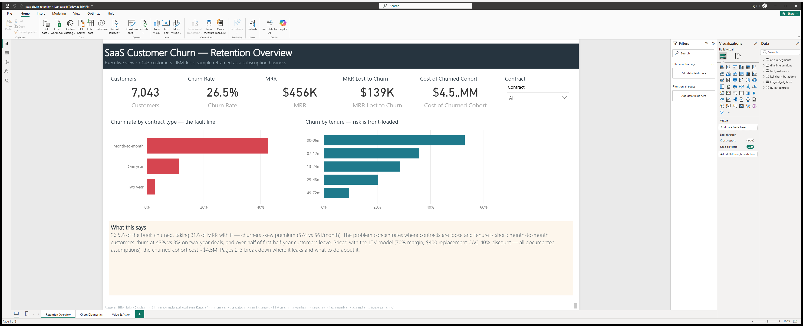

# Customer Churn Analysis & Retention Strategy

**The business problem:** A subscription business with 7,043 customers and
$456K in monthly recurring revenue is losing customers at 26.5% per cohort —
and the leavers skew premium ($74/month vs $61 for those who stay). This
project quantifies what that churn costs, finds where it concentrates, builds
a model that predicts who leaves next, and turns the findings into a costed,
self-funding retention plan.

Built on the public [Telco Customer Churn dataset](https://www.kaggle.com/datasets/blastchar/telco-customer-churn)
(Kaggle, originally IBM sample data), deliberately reframed as a
subscription/SaaS-style business — the unit economics (MRR, LTV, CAC)
transfer directly, and the reframing is stated everywhere it matters. See
[data-sources.md](data-sources.md).

## Key findings

| # | Finding | Number |
|---|---|---|
| 1 | Full economic cost of the churned cohort (foregone LTV + replacement CAC) | **$4.5M** (range $3.3–6.3M) |
| 2 | Churn by contract type — the fault line of the business | **43%** month-to-month vs **3%** two-year |
| 3 | Churn in the first 6 months of tenure (risk is front-loaded) | **53%** |
| 4 | Churn in the $70–90 price tier — the premium tier leaks most, and $70+ holds 71% of MRR | **38%** |
| 5 | Retention gradient across add-on services (0 → 6 add-ons) | **52% → 5%** |
| 6 | XGBoost model precision in the riskiest decile (2.9x lift vs random) | **77%** |
| 7 | Year-1 net PV of the recommended interventions, conservative assumptions | **~$0.4M** (~5x ROI) |



## What's in the box

| | |
|---|---|
| [notebooks/](notebooks) | Three executed walkthroughs: cleaning + EDA, the LTV/cost-of-churn model, and predictive modeling |
| [src/](src) | All logic as tested modules — [config.py](src/config.py) holds every business assumption in one place |
| [reports/strategy-deck.md](reports/strategy-deck.md) / [.pptx](reports/strategy-deck.pptx) | 7-slide strategy deck: problem → drivers → cost of inaction → options → recommendation |
| [reports/model-report.md](reports/model-report.md) | Model performance and limitations, written honestly |
| [reports/figures/](reports/figures) | Every chart as a standalone PNG |
| [explainer-guide/](explainer-guide/explain-it-to-me.md) | The whole project explained for a non-technical reader, with a glossary |
| [tests/](tests) | ~30 pytest checks on the cleaning, LTV math, and evaluation logic |
| [sql/](sql) | DuckDB validation layer: 7 data-quality checks, the KPI views behind every quoted number, and a claim-check query that recomputes the README headlines |
| [power-bi/](power-bi) | 3-page dashboard (.pbix + text source): retention overview, churn diagnostics, value & action |
| [data/](data/data_manifest.md) | **All data included** — raw file, cleaned table, and Power BI inputs, each documented in the manifest |

## Methodology (short version)

1. **Clean:** fix `TotalCharges` stored as text (11 blanks = unbilled new
   customers, set to $0, not dropped); derive tenure bands, price tiers,
   add-on counts. Documented in [notebook 01](notebooks/01-data-cleaning-eda.ipynb).
2. **Descriptive:** churn rate by contract, tenure, payment method, price
   tier, and service bundle; four named at-risk segments (each churns at ≥2x
   the base rate).
3. **Cost model:** exposure-based monthly churn hazard (events ÷
   customer-months) → expected lifetime (capped at the 72-month data window)
   → discounted LTV (70% gross margin, 10% discount rate) → cost of churn =
   foregone LTV + $400 replacement CAC. Assumptions benchmarked to published
   SaaS figures and stress-tested with a tornado sensitivity analysis.
4. **Predict:** class-weighted logistic regression baseline, then shallow
   XGBoost (test ROC-AUC 0.844 vs 0.838 — the honest headline is that the
   signal is mostly in a few strong features). Evaluated with PR-AUC and
   precision/recall at campaign depth, not accuracy. Drivers via SHAP,
   cross-checked against coefficients.
5. **Recommend:** three costed interventions (contract-shift incentive,
   model-targeted saves, onboarding-bundle pilot) with stated assumptions,
   deadweight haircuts, and a phased rollout.

## Reproducing the analysis

```bash
git clone https://github.com/shalom-wu/saas-churn-retention.git && cd saas-churn-retention
pip install -r requirements.txt

# The dataset is included in data/ (IBM sample data — see data/data_manifest.md)
python -m src.run_pipeline   # regenerates all figures + metrics (~1 min)
python scripts/run_sql.py    # data-quality checks, KPI views, Power BI exports
pytest                       # run the test suite
```

Python 3.11+ recommended. Notebooks re-execute with
`python -m nbconvert --to notebook --execute --inplace notebooks/*.ipynb`.

## Limitations (read before trusting the numbers)

- **Snapshot data.** No event timestamps, so the LTV model assumes a
  constant churn hazard per segment (churn is actually front-loaded — with
  timestamps this would be a survival model). Lifetimes are capped at the
  observation window to limit extrapolation.
- **The churn label's time window is unspecified.** 26.5% is treated as a
  cohort share, never a monthly rate.
- **Margin, CAC, and discount rate are industry benchmarks, not company
  actuals.** They live in [src/config.py](src/config.py) and the tornado
  chart shows exactly how much the headline moves when they're wrong.
- **Correlation ≠ causation.** Contract type is partly self-selection; the
  ROI model applies deadweight haircuts and the rollout plan requires A/B
  tests before scaling.
- **Telecom data in SaaS framing.** The method is the portable part; the
  specific coefficients are not.
- Full discussion: [reports/model-report.md](reports/model-report.md).

## SQL and Power BI layer

**SQL (DuckDB, [sql/](sql))** is the validation and KPI reference: seven
data-quality checks (it confirms the 11 zero-tenure rows and zero
duplicates), churn/MRR views by contract, tenure, payment, price tier and
add-on depth, the exposure-based churn hazard that feeds the LTV model, and
a claim-check view that recomputes every number quoted in this README —
`python scripts/run_sql.py` runs it all and writes the Power BI inputs to
`data/powerbi/`. Start with `sql/kpi_views.sql`, then Q8 in
`sql/analysis_queries.sql`.

**Power BI ([power-bi/](power-bi))** is the stakeholder view: a 3-page
.pbix (Retention Overview with the headline KPIs, Churn Diagnostics,
Value & Action with LTV, at-risk segments and the costed interventions),
built from the SQL exports plus the Python LTV tables. Model, DAX and
refresh steps are documented next to the file; refresh is one click after
rerunning the exporter.

The handoff is deliberate: SQL owns counting and rates, Python owns the
finance math (discounting) and modeling, Power BI presents both.



## Portfolio Use

**CV bullets**

- Built an end-to-end churn analysis on 7,043 subscription customers: a
  cost-of-churn model pricing the churned cohort at $4.5M (sensitivity
  $3.3–6.3M), churn prediction (XGBoost, test ROC-AUC 0.844), and three
  costed retention interventions (~$0.4M year-1 net PV at ~5x ROI).
- Implemented every churn KPI twice — DuckDB SQL views as the reference and
  pandas as the analysis layer — with a claim-check query that recomputes
  each README headline against the raw table.
- Delivered a 3-page Power BI dashboard (.pbix + generated text source)
  translating the LTV model and at-risk segmentation into an executive
  retention view.

**LinkedIn description**

> SaaS Customer Churn Analysis & Retention Strategy — Python, SQL and Power
> BI on the public IBM Telco dataset, reframed as a subscription business.
> The original work is the economics: an assumption-explicit LTV /
> cost-of-churn model ($4.5M cohort cost, stress-tested), an honest
> modeling comparison (gradient boosting barely beats logistic regression —
> and I say so), and three costed interventions. DuckDB validates every
> quoted number; Power BI turns it into a 3-page retention dashboard.

**Interview: how the tools work together**

> "SQL is the reproducible validation and aggregation layer — every churn
> rate and KPI is a DuckDB view, including a query that recomputes the
> README's claims. Python does the heavier lifting: the discounted LTV
> model, the churn classifier, the sensitivity analysis. Power BI sits on
> top as the stakeholder dashboard, reading only documented exports. That
> mirrors how analytics actually ships in a business: not one tool, but a
> workflow from raw data to decision-ready reporting."

## Author

Shalom Wu ([@shalom-wu](https://github.com/shalom-wu)) — analysis, cost
model, and strategy. Dataset credit: IBM sample data, hosted on Kaggle
(`blastchar/telco-customer-churn`). MIT licensed.
